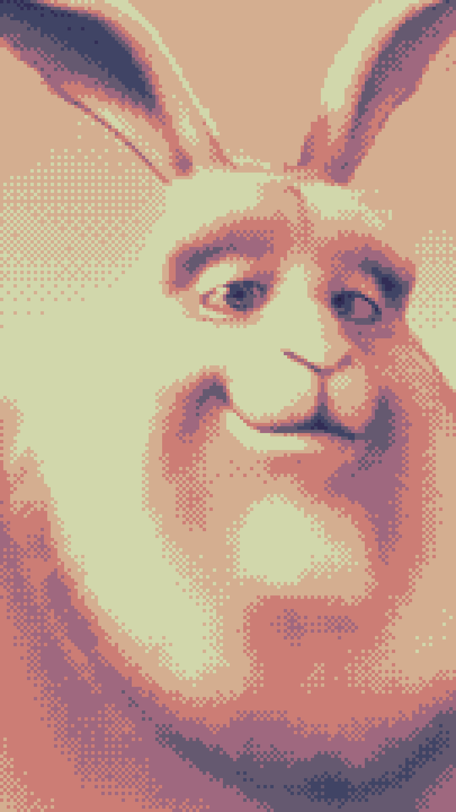

# retrovid
convert a video to a color limited, dithered format with an optional custom palette using ffmpeg

## requirements
`python`
`numpy`
`ffmpeg`

## usage
`./retrovid.py --input <input> --output <output> [options] [flags]`

## options
`--input <input>` path to input video (any video format ffmpeg supports)

`--output <output>` path to output video ending in `.mkv`

`--width <width>` output width in pixels (default: `128`, range: `2-8192`)

`--height <height>` output height in pixels (default: `112`, range: `2-8192`)

`--fps <fps>` output frames per second (default: `10`, range: `1-240`)

`--brightness <brightness>` adjust brightness (default: `0.0`, range: `-1.0 to 1.0`)

`--contrast <contrast>` adjust contrast (default: `1.0`, range: `-1000.0 to 1000.0`)

`--gamma <gamma>` adjust gamma-correction (default: `1.0`, range: `0.1 to 10.0`)

`--max-colors <maxcolors>` maximum number of colors in the output (default: `4`, range: `1-256`)

`--palette <palette>` comma-separated list of colors in `#RRGGBB` format (default: `""`)

`--dither <ditherer>` dithering algorithm to use (default: `bayer`, choices: `bayer`, `heckbert`, `floyd_steinberg`, `sierra2`, `sierra2_4a`, `sierra3`, `burkes`, `atkinson`, `none`)

`--bayer-scale <factor>` scale factor for bayer dithering (default: `2`, range: `0-5`)

`--down-scaler <scaler>` down-scaling algorithm to use (default: `bicubic`, choices: `fast_bilinear`, `bilinear`, `bicubic`, `neighbor`, `area`, `bicublin`, `gauss`, `sinc`, `lanczos`, `spline`)

`--up-scaler <scaler>` up-scaling algorithm to use (default: `neighbor`, choices: `fast_bilinear`, `bilinear`, `bicubic`, `neighbor`, `area`, `bicublin`, `gauss`, `sinc`, `lanczos`, `spline`)

`--up-scale-factor <factor>` up-scale factor applied to output (default: `None`)

`--threads <threads>` number of threads to use per ffmpeg process

## flags
`--overwrite` overwrite existing output video

`--auto-crop` automatically crop and resize input video to match output video size and aspect ratio

`--enable-audio` transcode audio from the input video

`--color-mode` preserve colors instead of converting to grayscale

## examples
### convert a video using the default settings (gameboy camera style)
`./retrovid.py --input input.mp4 --output output.mkv`

<!---->

### convert a video to 135×240 with auto-crop, using a custom 8 color palette, audio and upscale to x8 (instagram vertical style)
`./retrovid.py --input input.mp4 --output output.mkv --width 135 --height 240  --max-colors 8 --palette "#242040,#322d56,#404465,#655970,#9f687f,#cc7d75,#d4ae90,#d1d7ab" --auto-crop --enable-audio --up-scale-factor 8`

<!---->

## license
copyright (c) 2026 imhsan, licensed under the gnu gpl v3

you should have received a copy of the gnu general public License along with this program. if not, see <https://www.gnu.org/licenses/>
